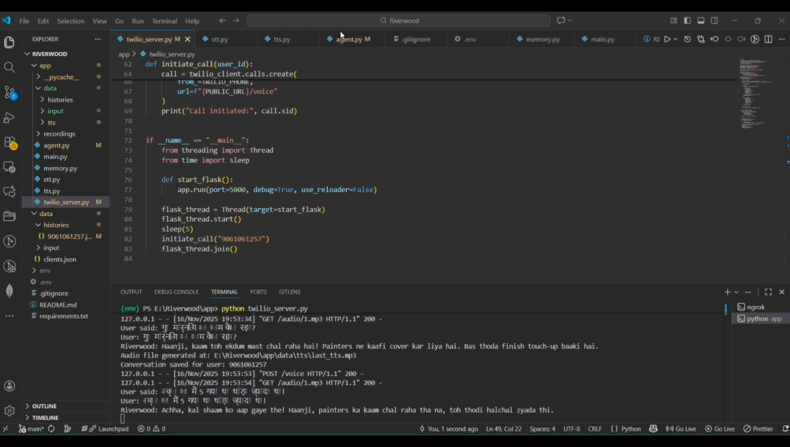

# Riverwood Voice Assistant — Twilio Construction Update Demo

**Riverwood** is a conversational **voice assistant for construction site updates**, powered by  
**Gemini LLM**, **ElevenLabs TTS**, and **Twilio Voice API**.

It remembers previous conversations, gives progress updates, and talks naturally in **Hinglish** —  
just like a real site assistant!

---

## Project Overview

This demo shows how **Riverwood** maintains **memory across calls**, greets the client personally,  
and provides daily project updates.

---

## Backend pipeline



---

## Demo Audio

[Riverwood Voice Assistant demo](https://drive.google.com/file/d/1BD18noFF7voOHRO5gqlWayHNOC2T8Dxq/view?usp=sharing)

---

## Tech Stack

| Component | Technology |
|------------|-------------|
| Voice Call Handling | **Twilio Voice API** |
| Language Model | **Gemini API** |
| Text-to-Speech | **ElevenLabs TTS API** |
| Memory | **Local JSON store (`memory.py`)** |
| Audio Storage | `data/tts/last_tts.mp3` |
| Client Data | `data/clients.json` |

---

## Directory Structure

```
Riverwood/
├── app/
│   ├── main.py                
│   ├── agent.py                
│   ├── tts.py                  
│   ├── memory.py               
│   ├── twilio_server.py        
│   ├── stt.py                  
│   └── data/
│       ├── clients.json
│       ├── history/
│       └── tts/
│           └── last_tts.mp3
├── data/
│   ├── input/                  
│   └── clients.json
└── README.md
```

---

## How It Works

1. **User calls via Twilio**
2. Speech is transcribed (Whisper / Twilio Speech Recognition)
3. `main.py` retrieves the latest context from memory
4. **Gemini** generates a contextual, human-like response
5. **ElevenLabs** converts the text to a natural Hinglish voice
6. The audio file (`last_tts.mp3`) is played back to the user
7. Conversation is logged in JSON for continuity

---

## Quick Start

```bash
# Clone repository
git clone https://github.com/Nidhin-jyothi/Riverwood-AI-Voice-agent.git
cd app

# Install dependencies
pip install -r requirements.txt

# Set up environment variables
# Create a .env file with your API keys (see below)

# Run Flask server
python app/twilio_server.py

# Expose using ngrok
ngrok http 5000
```

---

## Environment Variables

Create a `.env` file in the root directory with:

```ini
TWILIO_ACCOUNT_SID=your_account_sid_here
TWILIO_AUTH_TOKEN=your_auth_token_here
TWILIO_PHONE_NUMBER=your_twilio_number
ELEVENLABS_API_KEY=your_elevenlabs_key_here
GEMINI_API_KEY=your_gemini_api_key_here
```

---

## Running the Application

1. **Start the Flask server:**
```bash
python app/twilio_server.py
```

2. **Expose using ngrok:**
```bash
ngrok http 5000
```

3. **Configure Twilio Webhook:**
   - Copy the https forwarding URL from ngrok
   - Go to Twilio Console → Phone Numbers → Your Number
   - Set Voice Webhook (POST) to: `https://your-ngrok-url/voice`

---


